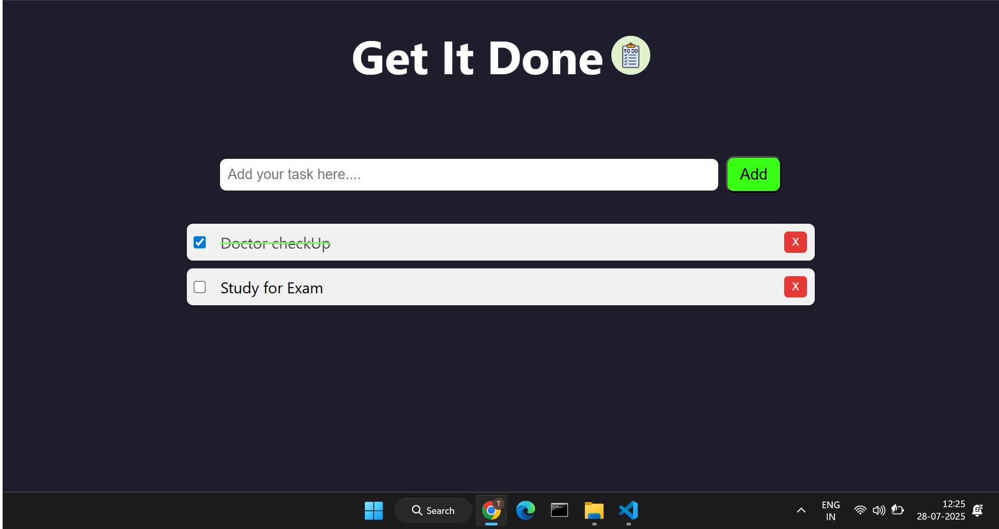

# 📝 To-Do List Web App

A beginner-friendly, stylish **To-Do List** built using **HTML**, **CSS**, and **JavaScript**. This project helps manage your daily tasks with a clean UI and interactive features.

---

## ✨ Features

- ➕ Add new tasks
- ✅ Mark tasks as completed (with green strike-through)
- ❌ Delete tasks individually
- 💾 Automatically saves tasks using **Local Storage**
- 🎨 Clean and responsive interface

---

## 📸 Screenshot



---

## 🚀 How to Use

1. Clone the repository or download the ZIP  
2. Open `index.html` in your browser

```bash
git clone https://github.com/TejasriBailika/ToDoList.git
cd ToDoList
